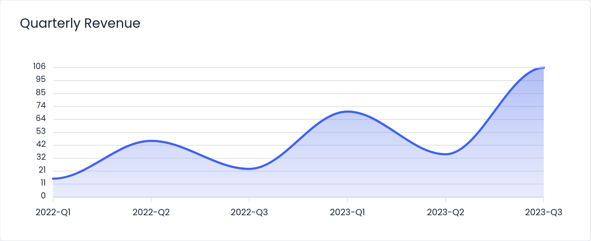
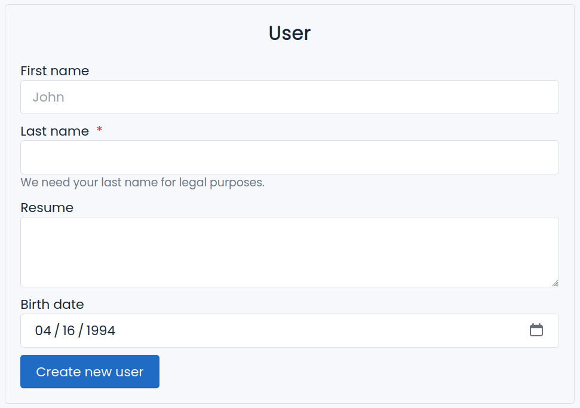
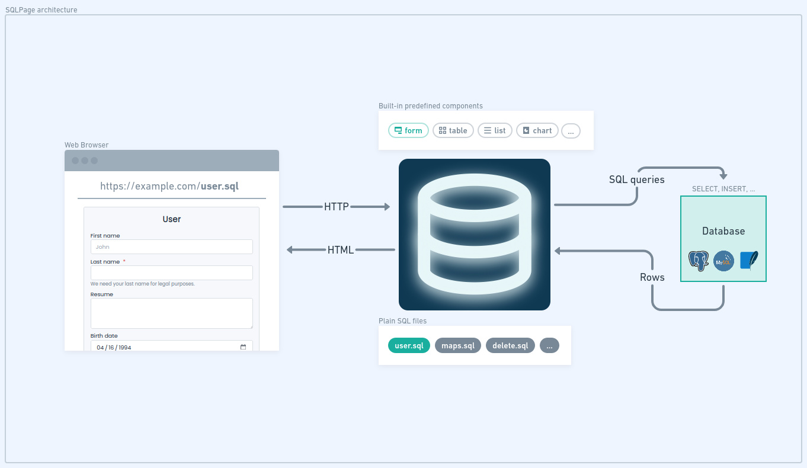

<h1 align="center">
SQLpage
</h1>

[](./docs/sqlpage.mp4)

[SQLpage](https://sql.ophir.dev) is an **SQL**-only webapp builder.
It is meant for data scientists, analysts, and business intelligence teams
to build powerful data-centric applications quickly,
without worrying about any of the traditional web programming languages and concepts.

With SQLPage, you write simple `.sql` files containing queries to your database
to select, group, update, insert, and delete your data, and you get good-looking clean webpages
displaying your data as text, lists, grids, plots, and forms.

## Examples

<table>
<thead>
<tr><td>Code<td>Result</tr>
</thead>
<tbody>
<tr>
<td>

```sql
SELECT 
    'list' as component,
    'Popular websites' as title;
SELECT 
    name as title,
    url as link,
    CASE type
      WHEN 1 THEN 'blue'
      ELSE 'red'
    END as color,
    description, icon, active
FROM website;
```

<td>


</tr>
<tr>
<td>

```sql
SELECT
  'chart' as component,
  'Quarterly Revenue' as title, 'area' as type;
SELECT quarter AS x, SUM(revenue) AS y
FROM finances GROUP BY quarter
```

<td>



</tr>
<tr>
<td>

```sql
SELECT 'form' as component, 'User' as title, 'Create new user' as validate;
SELECT name, type, placeholder, required, description
FROM user_form;

INSERT INTO user (first_name, last_name, birth_date)
SELECT ($first_name, $last_name, $birth_date)
WHERE $first_name IS NOT NULL;
```

<td>



</tr>
</tbody>
</table>

## Supported databases

- [sqlite](https://www.sqlite.org/index.html)
- [PostgreSQL](https://www.postgresql.org/), and other compatible databases such as *CockroachDB* and *Aurora*.
- [MySQL](https://www.mysql.com/), and other compatible databases such as *MariaDB* and *TiDB*.

## How it works



SQLPage is a [web server](https://en.wikipedia.org/wiki/Web_server) written in
[rust](https://en.wikipedia.org/wiki/Rust_(programming_language))
and distributed as a single executable file.
When it receives a request to a URL ending in `.sql`, it finds the corresponding
SQL file, runs it on the database,
passing it information from the web request as SQL statement parameters.
When the database starts returning rows for the query,
SQLPage maps each piece of information in the row to a parameter
in one of its pre-defined components' templates, and streams the result back
to the user's browser.

## Get started

- [Install docker](https://docs.docker.com/get-docker/)
- In a terminal, run the following command:
  - `docker run -it --name sqlpage -p 8080:8080 --volume "$(pwd):/var/www" --rm lovasoa/sqlpage`
  - (`"$(pwd):/var/www"` allows sqlpage to run sql files from your current working directory)
- Create a file called index.sql with the contents from [this example](./index.sql)
- Open https://localhost:8080 in your browser


## Examples

- [Tiny splitwise clone](./examples/splitwise): a shared expense tracker app
- [Corporate Conundrum](./examples/corporate-conundrum/): a board game implemented in SQL
- [SQLPage's own official website and documentation](./examples/official-site/): The SQL source code for the project's official site, https://sql.ophir.dev

## Configuration

SQLPage can be configured through either a configuration file placed in `sqlpage/sqlpage.json`
or environment variables such as `DATABASE_URL` or `LISTEN_ON`.

For more information, read [`configuration.md`](./configuration.md).

Additionally, custom components can be created by placing [`.handlebars`](https://handlebarsjs.com/guide/)
files in `sqlpage/templates`.

## Serverless

You can run SQLpage [serverless](https://en.wikipedia.org/wiki/Serverless_computing)
by compiling it to an [AWS Lambda function](https://aws.amazon.com/lambda/).
An easy way to do so is using the provided docker image:

```bash
 docker build -t sqlpage-lambda-builder . -f lambda.Dockerfile --target builder
 docker run sqlpage-lambda-builder cat deploy.zip > sqlpage-aws-lambda.zip
```

You can then just add your own SQL files to `sqlpage-aws-lambda.zip`,
and [upload it to AWS Lambda](https://docs.aws.amazon.com/lambda/latest/dg/gettingstarted-package.html#gettingstarted-package-zip),
selecting *Custom runtime on Amazon Linux 2* as a runtime.

### Hosting sql files directly inside the database

When running serverless, you can include the SQL files directly in the image that you are deploying.
But if you want to be able to update your sql files on the fly without creating a new image,
you can store the files directly inside the database, in a table that has the following structure: 

```sql
CREATE TABLE sqlpage_files(
  path VARCHAR(255) NOT NULL PRIMARY KEY,
  contents BLOB,
  last_modified TIMESTAMP DEFAULT CURRENT_TIMESTAMP
);
```

Make sure to update `last_modified` every time you update the contents of a file (or do it inside a TRIGGER).
SQLPage will re-parse a file from the database only when it has been modified.

## Technologies and libraries used

- [actix web](https://actix.rs/) handles HTTP requests at an incredible speed,
- [tabler](https://preview.tabler.io) handles the styling for professional-looking clean components,
- [tabler icons](https://tabler-icons.io) is a large set of icons you can select directly from your SQL,
- [handlebars](https://handlebarsjs.com/guide/) render HTML pages from readable templates for each component.
